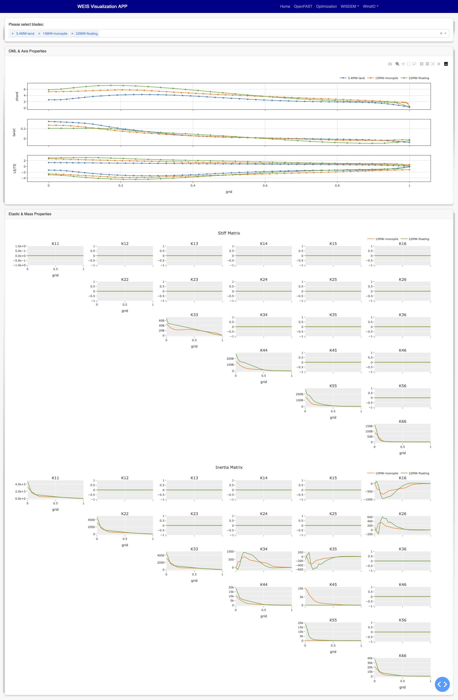

.. _weis_viz_app:

WEIS Visualization APP
=======================

This application provides a web-based graphical user interface to visualize input/output from WEIS.
For output visualization, the app can visualize the outputs of OpenFAST, a WEIS optimization including DLC statistics, and WISDEM (blade, cost).
The application can also visualize the WEIS geometry (WindIO) input, including 3D Wind Turbines Geometries and component properties of the airfoils, blade, and tower.

All of the graphical objects has been generated via Plotly library, which is easy to interact, zoom, and download the plots.

Installation
------------

We offer two types of installation: (1) for users who wants to leverage HPC and (2) for users working on their local machines. The HPC set up is in steps 1--3.  Users on local machines can skip to step 4. From our preliminary study, the app was able to successfully visualize the example optimization case which has around 430GB of information included.

1. Get an interactive node

.. code-block:: console

   salloc --time=60:00 --account=weis --partition=debug

2. Go to preferred directory

.. code-block:: console

   cd WEIS-Demo

3. Install WEIS and dependencies

We created a bash script which installs all of the related libraries with a single command. We recommend downloading that file first and then running the script.

.. code-block:: console

   wget https://raw.githubusercontent.com/WISDEM/WEIS/main/share/kestrel_install.sh -O kestrel_install.sh
   bash kestrel_install.sh -p [conda_env_path] -raft -wisdem
   # For example: bash kestrel_install.sh -p env/weis-env -raft -wisdem

Please check if the installation of weis, conda virtual environment, openfast, rosco, wisdem and raft are successful by running a few example cases.

**The following steps (4 and 5) apply to running the visualization application from an HPC host or locally.**

4. Generate visualization input yaml file

.. code-block:: console

   module load conda
   conda activate env/weis-env
   (.weis-env) $ cd weis/weis/visualization/appServer/share/
   (.weis-env) $ python vizFileGen.py --modeling_options [path_to_modeling_options] --analysis_options [path_to_analysis_options] --wt_input [path_to_final_wind_io] --output vizInput.yaml

Note that you can use the modeling and analysis options generated within the output folder of the WEIS run.
This output file will be generated by WEIS automatically in the near future.

Please make sure the file generation is successful. The file should include correct output directory structure. 
OpenFAST output file paths can be added as you wish, either with absolute path or with the relative path from ``WEIS``. An example is shown as below.

::

   outputDirStructure:
      dirs:
         of_COBYLA:
            dirs:
            openfast_runs:
               dirs:
                  Airfoils: ...
                  iteration_0: ...
                  iteration_1: ...
                  iteration_2: ...
                  wind:
   userOptions:
      deisgn_of_experiments: false
      inverse_design: false
      optimization:
         status: true
         type: 3
      output_fileName: IEA-22-280-RWT
      output_folder: examples/17_IEA22_Optimization/17_IEA22_OptStudies/of_COBYLA
      sql_recorder: true
      sql_recorder_file: log_opt.sql
   userPreferences:
      openfast:
         file_path:
            file1: examples/03_NREL5MW_OC3_spar/outputs/03_NREL5MW_OC3_spar/NREL5MW_OC3_spar_0.out
            file2: examples/06_IEA-15-240-RWT/outputs/06_IEA15_TMD_optimization/openfast_runs/DLC1.6_0_weis_job_0.out
            file3: examples/06_IEA-15-240-RWT/outputs/OpenFAST_DOE/openfast_runs/DLC1.6_0_weis_job_0.out
         graph:
            xaxis: Time
            yaxis:
            - Wind1VelX
            - GenPwr
            - BldPitch1
            - GenSpeed
            - PtfmPitch
      optimization:
         convergence:
            channels:
            - floating.jointdv_0
            - floating.jointdv_1
            - floating.memgrp1.outer_diameter_in
            - floatingse.system_structural_mass
         dlc:
            xaxis: Wind1VelX
            xaxis_stat: mean
            yaxis:
            - Wind1VelY
            - GenSpeed
            - PtfmPitch
            yaxis_stat: max
         timeseries:
            channels:
            - Wind1VelX
            - GenPwr
            - BldPitch1
            - GenSpeed
            - PtfmPitch
      wisdem:
         blade:
            shape_yaxis:
            - rotorse.rc.chord_m
            - rotorse.re.pitch_axis
            - rotorse.theta_deg
            struct_yaxis:
            - rotorse.rhoA_kg/m
            struct_yaxis_log:
            - rotorse.EA_N
            - rotorse.EIxx_N*m**2
            - rotorse.EIyy_N*m**2
            - rotorse.GJ_N*m**2
            xaxis: rotorse.rc.s
      output_path: examples/17_IEA22_Optimization/17_IEA22_OptStudies/of_COBYLA
   yamlPath: weis/visualization/appServer/app/tests/testIEA22OF.yaml

The selected channels from the app should be saved between runs, which help users to resume their previous work. 

5. Run the server

.. code-block:: console
   
   cd ../app
   (.weis-env) $ python mainApp.py --input [path_to_viz_input] --host [host_number] --port [port_number]

Now, you are able to see the hosting url with defined port number where your app server is running.
Depending on your operating system, some valid host numbers (for the local host) are 0.0.0.0, 127.0.0.1, and 192.168.0.0.
If you are having issues seeing the host and port returned, try ``unset HOST``.

6. Connect the app with local machine

After finishing the set up from the HPC, open a new terminal from your local machine and run:

.. code-block:: console

   ssh -L [port_number]:[host_name from \#1]:[port_number] kl1.hpc.nrel.gov
   # For example, if you have not assigned specific port number to app: ssh -L 8050:[host_name from \#1]:8050 kl1.hpc.nrel.gov

Open a web browser, preferably Safari or Chrome, and go to the hosting url that shows from step \#5.

WEIS Outputs
------------

OpenFAST
~~~~~~~~

Plot OpenFAST time series from a WEIS optimization output directory. The user can select the channels they wish to plot. The outputs are from the last optimization iteration. 

.. image:: images/viz/WEIS_Outputs/OpenFAST.png

Optimization
~~~~~~~~~~~~

OpenFAST optimization
*********************

First, we need to check if the optimization type is correct. For OpenFAST Optimization, please check if status is true and type is 3 from the userOptions/optimization. 
Then, we read design constraints and variables from userPreferences/optimization.

Please make sure data is loaded first by pressing ``Load`` button.

Optimization convergence trend data will be first shown on the left, from the log_opt.sql file. 
The user can click on a specific iteration, and the corresponding DLC statistics will be shown on the right. 
The specific OpenFAST time-series plots can be visualized as well via clicking specific data points.

RAFT optimization
*****************

First, we need to check if the optimization type is correct. For RAFT Optimization, please check if status is true and type is 1 from the userOptions/optimization. 
Then, we read platform design variables from userPreferences/optimization/convergence/channels.

Please make sure data are loaded first by pressing ``Load`` button.

By selecting a specific iteration from the convergence graph, the corresponding 3D platform design plot will appear on the right.

WISDEM - Blade
~~~~~~~~~~~~~~
Read blade related properties from the openmdao output channels, and visualize the following information.

WISDEM - Cost
~~~~~~~~~~~~~
Cost-related variables are also an output of WISDEM and WEIS. 
The tool reads the openmdao outputs and visualizes the cost-breakdown. 
Note that cost calculation is based on `NREL CSM model <https://wisdem.readthedocs.io/en/master/wisdem/nrelcsm/theory.html>`_ .

WEIS Inputs
------------

To visualize WEIS inputs files, import them on the home page. 
Enter the file path, a label name, and file type and click ``Add`` button, then confirm if the file has been successfully loaded under ``Result`` table.
Three types of inputs - modeling, analysis, and geometry - exist, but we only support geometry yaml files for now. For better understanding, please refer to :doc:`WEIS Inputs <inputs/yaml_inputs>`.
The app has been tested with three sample geometry yaml files - ``3.4MW``, ``15MW``, ``22MW`` from `examples/00_setup/ref_turbines <https://github.com/WISDEM/WEIS/tree/main/examples/00_setup/ref_turbines>`_ .

3D Visualization
~~~~~~~~~~~~~~~~~

The Dash-VTK library is used to render 3D geometries from WindIO format. The app provides an interactive interface where users can compare multiple wind turbines with pan, rotate, zoom, etc. 
If user clicks a specific turbine component (blade, tower, hub, nacelle), the local-view of each component across multiple turbines is provided with detailed information.

.. video:: images/viz/WEIS_Inputs/interactive.mp4
   :width: 900
   :autoplay:

.. image:: images/viz/WEIS_Inputs/blade1.png

.. image:: images/viz/WEIS_Inputs/hub.png
   :width: 48%

.. image:: images/viz/WEIS_Inputs/nacelle.png
   :width: 48%

Airfoils Properties
~~~~~~~~~~~~~~~~~~~

.. image:: images/viz/WEIS_Inputs/airfoils.png

Blade Properties
~~~~~~~~~~~~~~~~

Tower Properties
~~~~~~~~~~~~~~~~

.. image:: images/viz/WEIS_Inputs/tower.png

Reference
------------

Application File Structure
~~~~~~~~~~~~~~~~~~~~~~~~~~~~

::

   visualization/
        ├── appServer/
        │        ├── app/
        │        │      ├── assets/
        │        │      ├── mainApp.py              
        │        │      ├── pages/
        │        │      │     ├── home.py
        │        │      │     ├── visualize_openfast.py
        │        │      │     ├── visualize_opt.py
        │        │      │     ├── visualize_wisdem_blade.py
        │        │      │     ├── visualize_wisdem_cost.py
        │        │      │     ├── visualize_windio_3d.py
        │        │      │     ├── visualize_windio_airfoils.py
        │        │      │     ├── visualize_windio_blade.py
        │        │      │     └── visaulize_windio_tower.py
        │        │      └── tests/
        │        │              ├── test_app.py
        │        │              ├── test_3d_callbacks.py
        │        │              ├── test_airfoils_callbacks.py
        │        │              ├── test_blade_callbacks.py
        │        │              ├── test_tower_callbacks.py
        │        │              └── test_raft_opt.py
        │        │                
        │        └── share/
        │            ├── auto_launch_DashApp.sh
        │            ├── sbatch_DashApp.sh                
        │            └── vizFileGen.py
        ├── meshRender.py
        └── utils.py
