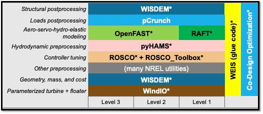
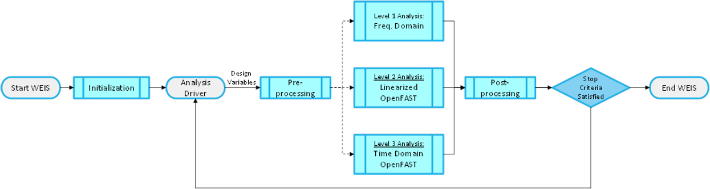

How WEIS works
--------------

WEIS is a stack of software that can be used for floating wind turbine design and analysis.  The turbine’s components (blade, tower, platform, mooring, and more) are parameterized in a geometry input. The system engineering tool `WISDEM <https://github.com/WISDEM/WISDEM>`_ determines component masses, costs, and engineering parameters that can be used to determine modeling inputs.  A variety of pre-processing tools are used to convert these system engineering models into simulation models.  

The modeling_options.yaml determines how the turbine is simulated.  We currently support `OpenFAST <https://github.com/OpenFAST/openfast>`_ and `RAFT <https://github.com/WISDEM/RAFT>`_.  

The analysis_options.yaml determine how to run simulations, either a single run for analysis, a sweep or design of experiments, or an optimization.  

A full description of the inputs can be found `here <https://github.com/WISDEM/WEIS/tree/master/weis/inputs>`_ (will point to rst when available).

WEIS is `"glued" <https://github.com/WISDEM/WEIS/blob/master/weis/glue_code/glue_code.py>`_ together using `openmdao <https://openmdao.org/>`_ components and groups.

WEIS works best by running `examples <https://github.com/WISDEM/WEIS/tree/master/examples>`_:
 * `01_aeroelasticse <https://github.com/WISDEM/WEIS/tree/master/examples/01_aeroelasticse>`_ can be used to set up batches of aeroelastic simulations in OpenFAST
 * `02_control_opt <https://github.com/WISDEM/WEIS/tree/master/examples/02_control_opt>`_ can be used to run WEIS from an existing OpenFAST model, and optimize control parameters only
 * `03_NREL5MW_OC3 <https://github.com/WISDEM/WEIS/tree/master/examples/03_NREL5MW_OC3_spar>`_ and `04_NREL5MW_OC4_semi <https://github.com/WISDEM/WEIS/tree/master/examples/04_NREL5MW_OC4_semi>`_ can be used to simulate the OC spar and semi, respectively, from WISDEM geometries.
 * `05_IEA-3.4-130-RWT <https://github.com/WISDEM/WEIS/tree/master/examples/05_IEA-3.4-130-RWT>`_ runs the design load cases (DLCs) for the fixed-bottom IEA-3.4 turbine
 * `06_IEA-15-240-RWT <https://github.com/WISDEM/WEIS/tree/master/examples/06_IEA-15-240-RWT>`_ contains several examples for running the IEA-15MW with the VolturnUS platform, including tower and structural controller optimization routines
 * `15_RAFT_Studies <https://github.com/WISDEM/WEIS/tree/master/examples/15_RAFT_Studies>`_ contains an example for optimizing a the IEA-15MW with the VolturnUS platform in RAFT
More documentation specific to these examples can be found there, with more to follow.

This documentation only covers a summary of WEIS's functionality.  WEIS can be adapted to solve a wide variety of problems.  If you have questions or would like to discuss WEIS's functionality further, please email dzalkind (at) nrel (dot) gov. 

