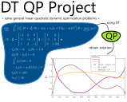

## README (dt-qp-project)
This project solves linear-quadratic dynamic optimization (LQDO) problems using direct transcription (DT) and quadratic programming (QP)

---
### Citation
Please cite the following two items if you use the DT QP Project:
* DR Herber. *Advances in Combined Architecture, Plant, and Control Design.* PhD Dissertation, University of Illinois at Urbana-Champaign, Urbana, IL, USA, Dec. 2017. [[bibtex]](http://systemdesign.illinois.edu/~systemdesign/bibtexbrowser.php?key=Herber2017e&bib=esdl_refs.bib) [[pdf]](http://systemdesign.illinois.edu/publications/Her17e.pdf)
	- *Discusses the theory behind this project and contains a number of examples comparing the different methods.*
* DR Herber, YH Lee, JT Allison. *DT QP Project*, GitHub. url: [https://github.com/danielrherber/dt-qp-project](https://github.com/danielrherber/dt-qp-project)

---
### General Information
This is a limited implementation of the [DTQP](https://github.com/danielrherber/dt-qp-project) in python to solve strictly linear-quadratic dynamic optimizations problems on simple equi-distant mesh.
Unlike DTQP, DTQPy has only the composite trapezoidal (CTR) method implemented for transcribing the objective function, and the dynamic constraints.
Additionally, no mesh-refinement feature has been implemented.

#### Contributors
- [Athul K. Sundarrajan](https://github.com/AthulKrishnaSundarrajan)
- [John Jasa](https://github.com/johnjasa)
- [Daniel Zalkind](https://github.com/dzalkind)
- [Daniel R. Herber](https://github.com/danielrherber) (primary)

