# WEIS-Visualization
Full-stack development for WEIS input/output visualization. This application provides a web-based graphical user interface to visualize input/output from WEIS. The app provides three types of output visualization - OpenFAST, Optimization with DLC Analysis, and WISDEM (blade, cost).

```bash
app/
├── assets/
├── mainApp.py
├── requirement.yaml                                  # Need to be generated
├── WEIS_Output/                                      # Need to be generated                     
└── pages/
    ├── home.py
    ├── visualize_openfast.py
    ├── visualize_opt.py
    ├── visualize_wisdem_blade.py
    └── visualize_wisdem_cost.py
```

## Before Start
1. Make sure conda environment '**weis-env**' is ready. We are using the same virtual environment from WEIS, and all of the visualization-related utils functions are located under **WEIS/weis/visualization/utils.py**.
2. For customizing user preferences and saving their local changes, we require input yaml file to run the tool. Please refer to 'app/test.yaml' file and follow the same structure. [MC - to add code/explanation how to generate requirement.yaml]

## How to Start
```
conda activate weis-env                                                   # Activate the new environment
git clone https://github.com/sora-ryu/WEIS-Visualization.git              # Clone the repository
cd app/
python mainApp.py --port [port_number] --host [host_number] --debug [debug_flag] --yaml [input_yaml_file_path]  # Run the App (e.g., python mainApp.py --port 8060 --host 0.0.0.0 --debug False --yaml test.yaml)
```
## Results
### OpenFAST
Read OpenFAST related variables, including OpenFAST output file paths and graph x,y axis settings, and visualize the graphs based on them. Note that we allow maximum 5 files to visualize and please keep 5 rows. If you have only three files to visualize, please keep file4 and file5 values as 'None' and don't delete them. The file paths should be the relative path to the current directory 'app/'.

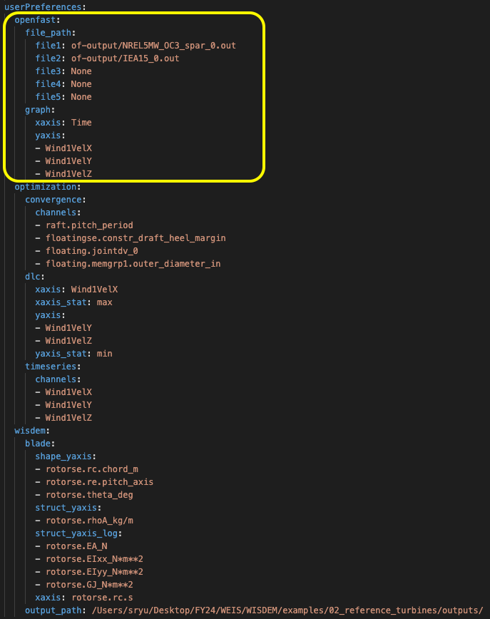
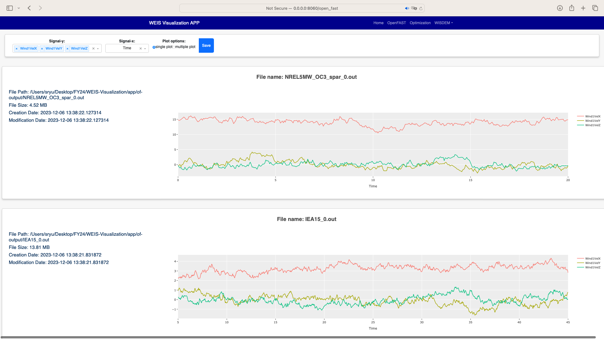
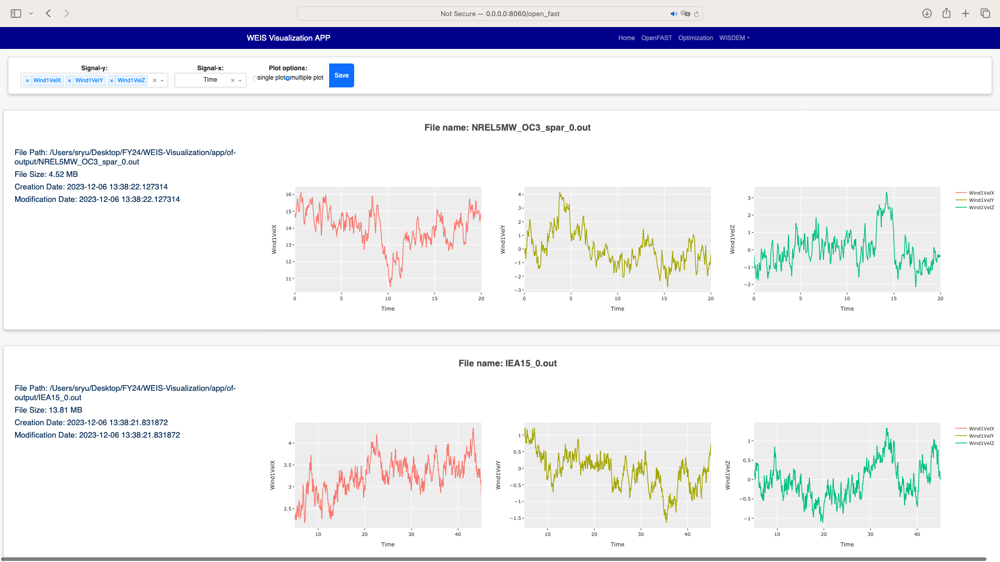

Current graph channels will be saved under the yaml file once save button is clicked. Plots generated by Plotly can be downloaded with icon as well.
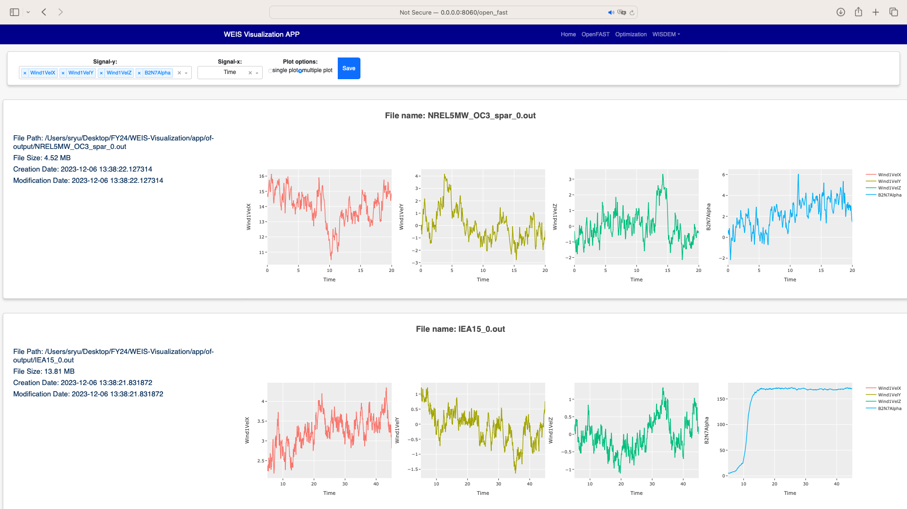
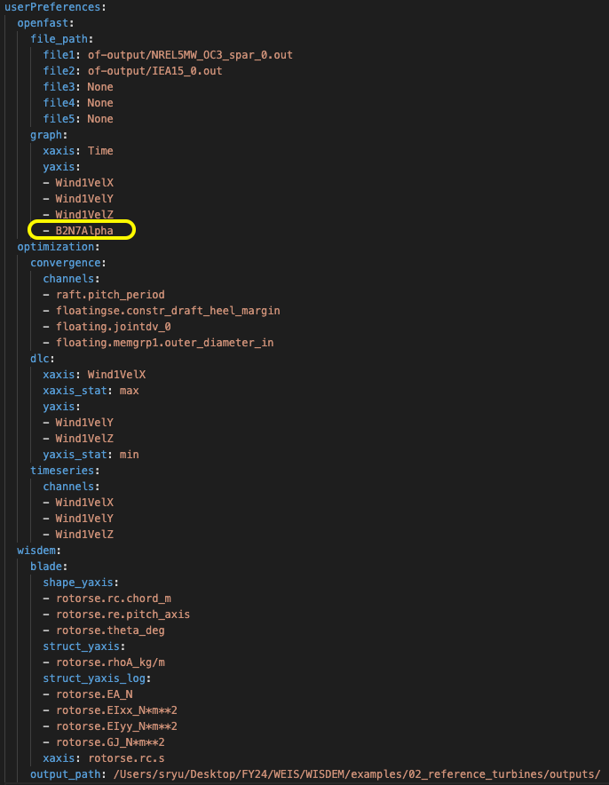

### Optimization
Read optimization related variables from requirement.yaml file. Optimization convergence trend data will be first shown on the left layout, analyzing log_opt.sql file. Then, user can click specific iteration and corresponding DLC visualization will be shown on the right layout. The specific OpenFAST time-series plots can be visualized as well via clicking specific outlier data. Graph channels will be automatically saved as user changes, and plots can be also downloaded with icon.
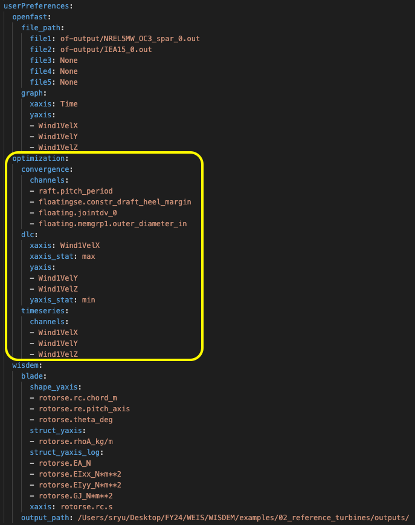
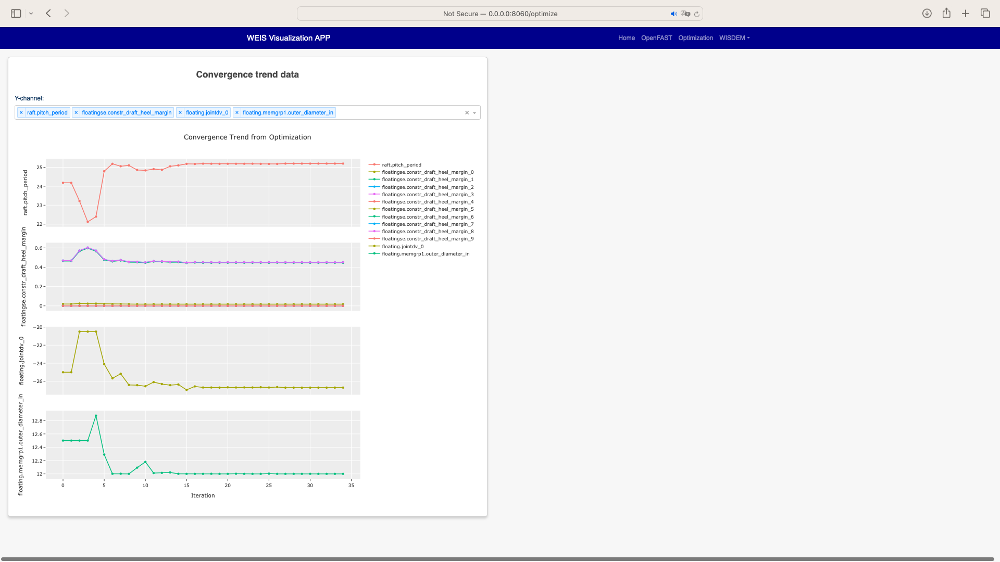
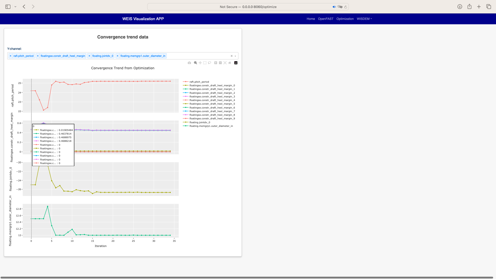
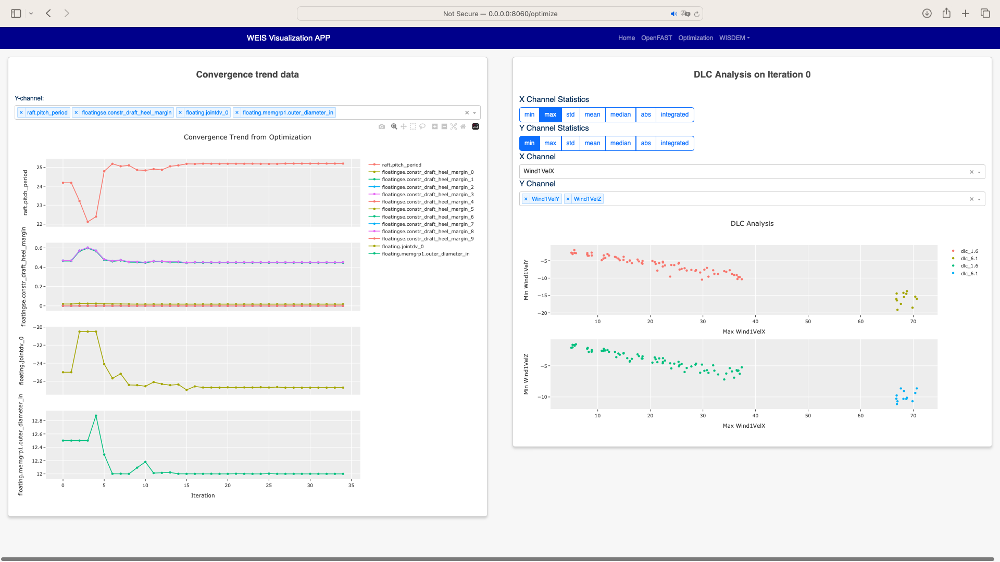
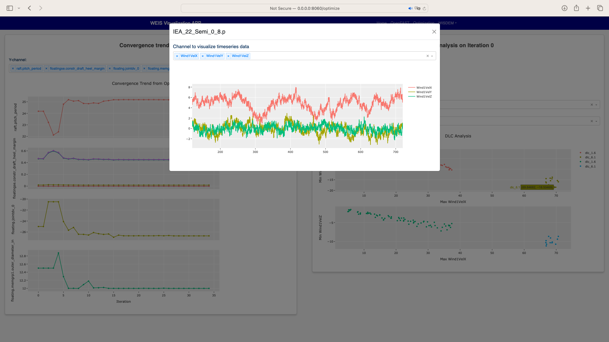

### WISDEM - Blade
Read blade related properties and WISDEM output file path from requirement.yaml file, and visualize the graphs based on them.
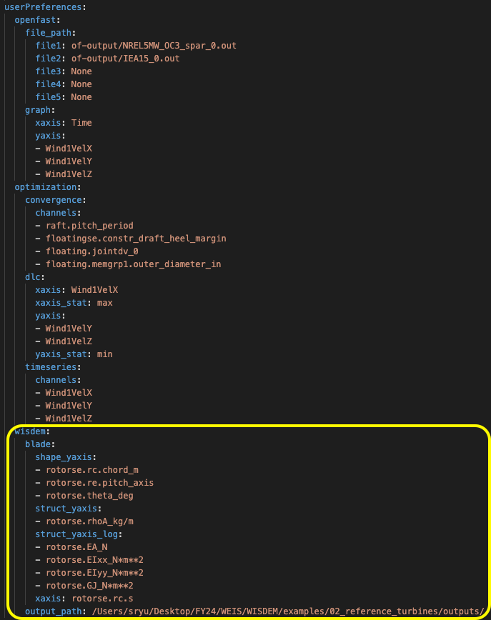
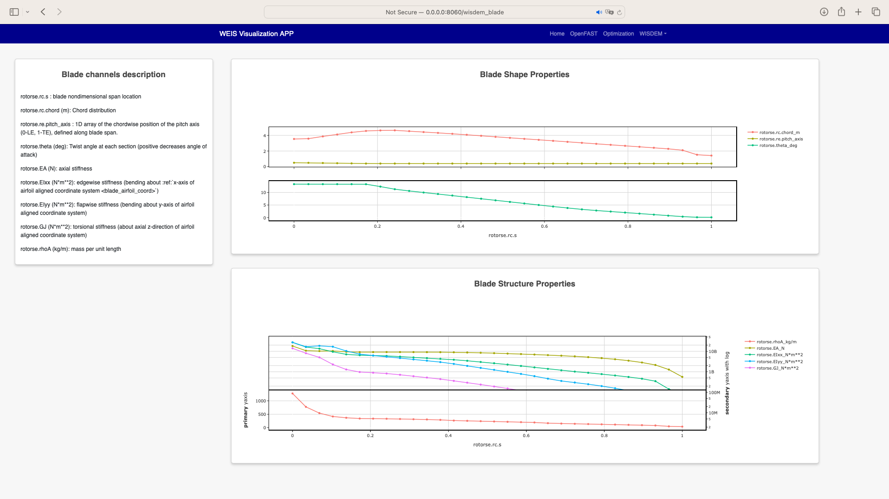

### WISDEM - Cost
Cost related variables are already fixed under the code. Read WISDEM output file path from requirement.yaml file, and visualize the cost-breakdown nested graph. Note that cost calculation is based on NREL CSM model (https://wisdem.readthedocs.io/en/master/wisdem/nrelcsm/theory.html#blades).
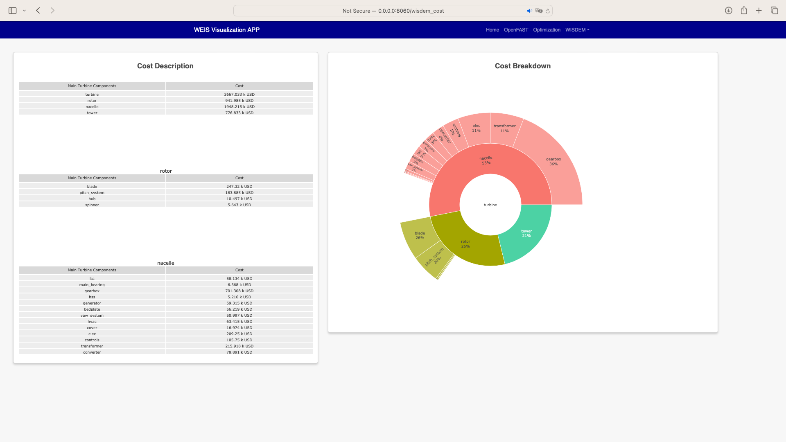

## Documentation
### Outputs from WEIS and each location
Once optimization is done, all logs over all iterations are recorded in log_opt.sql file. Each iteration folder contains time series data from each openfast runs and the summary of statistics. summary_stats.p file is multi-index dataframe where it summarizes the statistics for each run. The statistics metrics include 'min, max, std, mean, median, labs and integrated'. The information on what openfast file indices corresponds to can be located in case_matrix.txt and case_matrix.yaml files.

Below is the sample file structure from WEIS Ouputs.

```bash
WEIS_Output/
├── IEA-22-280-RWT-analysis.yaml
├── IEA-22-280-RWT-modeling.yaml
├── IEA-22-280-RWT.csv
├── IEA-22-280-RWT.mat
├── IEA-22-280-RWT.npz
├── IEA-22-280-RWT.pkl
├── IEA-22-280-RWT.xlsx
├── IEA-22-280-RWT.yaml
├── log_opt.sql                                  # The optimization iteration logs generated from openmdao
└── openfast_runs/
    └── rank_0/
        ├── case_matrix.txt                      # Where we dump all cases for the iterations
        ├── case_matrix.yaml                     # yaml version of case_matrix.txt
        ├── iteration_0/
        │   ├── DELs.p
        │   ├── fst_vt.p                         # Related to input ?
        │   ├── summary_stats.p                  # The summary of optimization
        │   └── timeseries/
        │       ├── IEA_22_Semi_0_0.p
        │       ├── IEA_22_Semi_0_1.p
        │       │         .
        │       │         .
        │       │         .
        │       └── IEA_22_Semi_0_n.p            # Where (n+1) openfast runs has been processed
        ├── iteration_1/
        │        .
        │        .
        │        .
        └── iteration_m/                         # Where we have m iterations in this specific weis optimization example
```
## Issues
Please open issues on GitHub if you encounter any problems with this software.

<!-- ## To-Do Checklist
### Quarter 1
- [x] Build multi-page app prototype
- [x] Implement an OpenFAST output visualization page

### Quarter 2
- [x] Implement Optimization page - optimization convergence data
- [x] Implement Optimization page - DLC/OpenFAST statistics
- [x] Implement Optimization page - outlier DLC with OpenFAST time-series with modal window
- [x] Implement Optimization page - update layout to handle a bunch of plots
- [x] Implement WISDEM Viz page - blade

### Quarter 3
- [x] Read user preferences
- [x] Update the user preferences, variable settings from yaml file
- [x] Trivial function updates - accept only yaml file for input, solve warning errors (nonexistent object at the callback functions)
- [x] Maintain the progress even if changing tabs
- [x] Find file paths from dir tree from yaml file
- [x] Implement WISDEM Viz page - cost
- [x] Merge into WEIS - verify if it works well with 'weis-env' -->

<!-- ## ETC (If needed)
- [ ] Merge into WEIS - version match doesn't work.. assuming the reason=python version. Change the code to gain proper plot..
- [ ] Implement WISDEM Viz page - general
- [ ] Implement WISDEM Viz page - doc for customized viz function
- [ ] Improve UI - drag and drop card -->
<!-- ## Guideline for building customized viz function for WISDEM output
1. Add NavItem from mainApp.py. Add dropdownmenu item at line 33 and declare href link to the page.
2. Create page under pages/ folder. Try to set the name with visualize_wisdem_<>.py.
3. Register the page with href link you defined from Step 1. -->