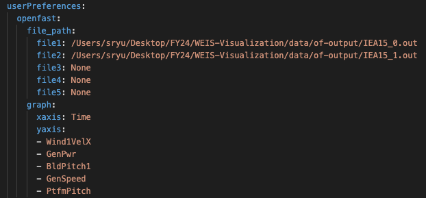
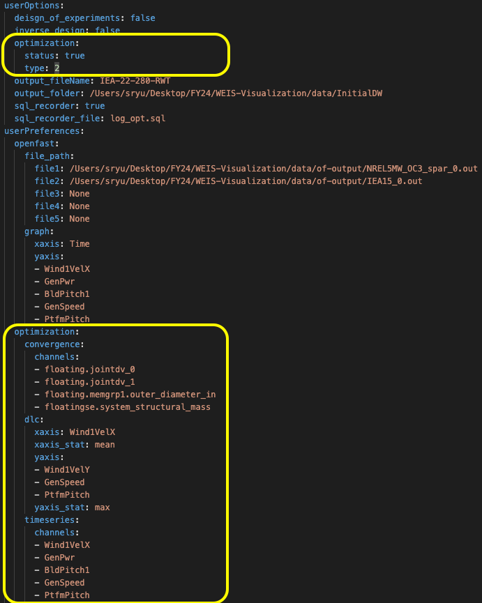
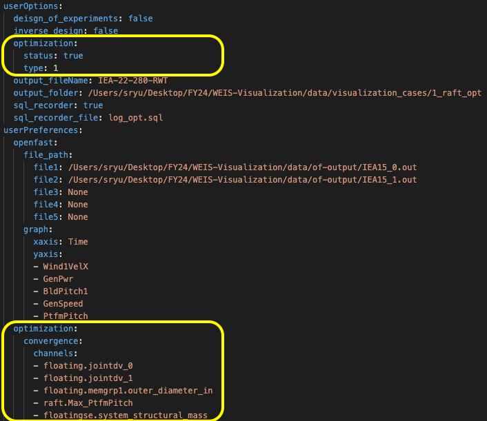
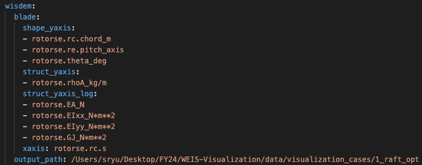

Results
=====

All of the graphical objects has been generated via Plotly library, which makes users to easily interact, zoom in, download with it. We also offer graph channel saving functions, which help users to resume their research from their previous status. Note that graph channels from the OpenFAST page will be saved once save button has been clicked.

OpenFAST
------------
Read OpenFAST related variables from the input yaml file, including OpenFAST output file paths and graph x,y axis settings, and visualize the graphs based on them. Note that we allow maximum 5 files to visualize and please keep 5 rows. If you have only three files to visualize, keep file4 and file5 values as 'None' and don't delete them. We recommend the file paths to be absolute path.

.. image:: ../../figures/OpenFAST.pdf

Optimization
------------

OpenFAST optimization
~~~~~~~~

First, we need to check if the optimization type is correct. For OpenFAST Optimization, please check if status is true and type is 2 from the userOptions/optimization. Then, we read design constraints and variables from userPreferences/optimization.

.. image:: ../../figures/Optimize2_1.pdf

.. image:: ../../figures/Optimize2_2.pdf

Optimization convergence trend data will be first shown on the left layout from the analyzed log_opt.sql file. Then, user can click specific iteration and corresponding DLC visualization will be shown on the right layout. The specific OpenFAST time-series plots can be visualized as well via clicking specific outlier data.

RAFT optimization
~~~~~~~~

First, we need to check if the optimization type is correct. For RAFT Optimization, please check if status is true and type is 1 from the userOptions/optimization. Then, we read platform design variables from userPreferences/optimization/convergence/channels.

.. image:: ../../figures/Optimize1.pdf

Once clicking specific iteration, the corresponding 3D platform design plot appears from the right layout.

WISDEM - Blade
------------
Read blade related properties and WISDEM output file path from the input yaml file, and visualize the graphs based on them.

.. image:: ../../figures/WISDEM-Blade.pdf

WISDEM - Cost
------------
Cost related variables are already defined from the code. Read WISDEM output file path from the input yaml file, and visualize the cost-breakdown nested graph. Note that cost calculation is based on NREL CSM model (https://wisdem.readthedocs.io/en/master/wisdem/nrelcsm/theory.html#blades).

.. image:: ../../figures/WISDEM-Cost.pdf
